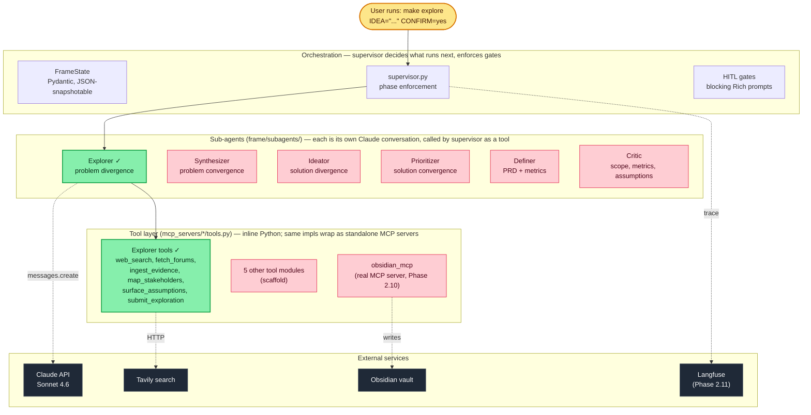

# Frame

**A multi-agent PM workflow that turns a vague idea into a defensible PRD by enforcing problem-space discipline before solution mode.**

Most PMs — and most AI tools that try to help PMs — jump straight to solutions. Frame structurally prevents this: it diverges on the problem, converges to one, gates it for human approval, *then* diverges on solutions, converges via prioritization, gates again, and only then writes the PRD. A final critic checks for scope drift, metric quality, and hidden assumptions.

Local-only. CLI-only. Single user. Built as both a working tool and a portfolio piece for PM roles at AI-native companies.

---

## Architecture



**Green nodes are wired and tested. Pink nodes are scaffolded but not yet built. Yellow is the user entry point. Dark grey is external.**

**Runtime flow:** `Idea → Explorer → Synthesizer → [GATE 1: lock problem] → Ideator → Prioritizer → [GATE 2: lock solution] → Definer → Critic → PRD (with Alternatives Considered appendix containing every killed solution and its reason_killed).`

The two human-in-the-loop gates stop the supervisor cold. Gate 1 forces a problem statement to be locked before the pipeline can enter solution space. Gate 2 forces a solution to be locked before it can enter the output phase. Killed solutions stay visible in the final PRD with `reason_killed` and `revisit_conditions`.

---

## Current capability

### Phase 1 — Scaffold (commit `4d19668`)
- Full repo skeleton: 7 Pydantic schema modules, 7 MCP server stubs, supervisor with phase enforcement, 7 entry-point modes (idea-only, idea+evidence, evidence-only, locked-problem, locked-problem+solution, draft-PRD, resume-from-vault), Typer CLI, observability + preprocessing modules stubbed
- 15 unit tests + 1 eval placeholder, all green
- Stubs only — no real API calls anywhere. Supervisor walks the full phase sequence using empty Pydantic returns so the orchestration shape is sanity-checkable before any agent goes real

### Phase 2 step 1 — Explorer real (commit `3f4d97b`)
- Hand-designed prompt with 10 hard rules + 8 failure modes encoded
- `ExplorationResult` Pydantic schema with 5 model validators (15+ signals, 3+ distinct sources, no single source >40%, 3+ distinct stakeholder types, contradiction signal-refs valid)
- 6 inline-Python tools: `web_search_user_signals`, `fetch_forum_threads`, `ingest_evidence`, `map_stakeholders`, `surface_assumptions`, `submit_exploration`
- MCP server wrappers over the same tool implementations — single source of truth, the MCP server stays runnable for external clients (Claude Desktop, Cursor, etc.)
- In-code search budget enforcement (`SEARCH_BUDGET = 6`) backing the prompt's hard rule
- Strict `submit_exploration`: Pydantic `ValidationError` propagates rather than getting fed back to Claude for retry — surfaces real schema gaps
- 3 tests: happy-path (real Claude + Tavily, India JEE idea), with-evidence (real APIs, B2B release-notes + seeded evidence, asserts at least one outside-evidence search), malformed-submit (fake Anthropic client, asserts `ValidationError` propagates)

**See [docs/sample-exploration.md](docs/sample-exploration.md)** — actual `ExplorationResult` from a real run against *"Productivity apps have the highest churn rate out of all B2C apps, so users are not finding productivity apps useful."* Shows 7 adjacent problems, 4 context constraints, 22 verbatim user signals from 7 subreddits + 2 HN posts + 4 blogs + 2 academic sources, 5 stakeholders, 6 assumptions (including the user's embedded causal claim flagged as `criticality: high`), 2 structural contradictions with signal-id refs.

---

## Design decisions

The choices made and why. Each is reversible if it turns out wrong — the cost of being wrong is what shaped each call.

### Anthropic SDK + tool calling, not LangGraph or other state-graph frameworks
LangGraph's value is graph-based agent orchestration with built-in state management. Frame's pipeline is linear with two human gates — a graph framework is overkill. The supervisor is one Claude conversation with a phase-enforcement system prompt and a Pydantic `FrameState` passed between turns. Simpler debugging, no framework lock-in, no learning curve for anyone reading the code.

### Sub-agents as inline Python tools, not 7 stdio MCP servers
The original spec had 6 specialist sub-agents each connected to its own MCP server over stdio. For an internal Python CLI that's 6 subprocesses, 6 JSON-RPC round trips, and 6 schema-translation layers — without anything reusing those tools externally. Frame uses inline Python: sub-agents are functions in `frame/subagents/*.py`, tools are functions in `mcp_servers/*/tools.py`, the supervisor calls them directly.

**Obsidian is the one exception** — `mcp_servers/obsidian_mcp/server.py` is a real stdio MCP server because a markdown-vault writer is genuinely useful from Claude Desktop, Cursor, and other MCP clients. The other 6 MCP server skeletons exist in the repo and can be promoted to real servers if external reuse becomes valuable, but they're not in the hot path.

### Hand-designed prompts, not LLM-generated
Every agent prompt is hand-tuned. Phase 1 scaffolding never wrote prompt content — each prompt file shipped as a TBD placeholder until the prompt was finalized in a separate planning session. Prompts are the most consequential thing in the system; outsourcing their design to an LLM at scaffold time pre-commits decisions before the human knows what they're optimizing for.

### Strict `submit_exploration`, not retry-on-validation-error
When Claude submits an `ExplorationResult` that fails Pydantic validation, the error propagates out of `explorer.run()`. No catch-and-retry. The reasoning: in Phase 2 step 1, validation failures are signal — they tell us where the prompt or schema is misaligned. Auto-retrying would mask that. We can wrap the call site with retry semantics later without changing the contract.

### Cost discipline as enforced rules, not vibes
Real Anthropic + Tavily API calls cost real money. Frame's defaults are paranoid:
- `pyproject.toml` has `addopts = "-m 'not integration'"` — a plain `pytest` invocation will NEVER hit a paid API even when `.env` has keys
- The `make explore` target requires both `IDEA="..."` and `CONFIRM=yes`. Either missing → refused
- `bin/run_explorer.py` requires `--confirm` flag
- Cost estimates as comments at the top of every paid-API script and test file
- `run_in_background` banned for paid-API work — foreground only so Bash's default timeout actually bites

These rules are reflected in `~/.claude/CLAUDE.md` so future Claude Code sessions inherit them. See [feedback_cost_discipline](https://github.com/anthropics/claude-code/) memory for the lesson behind it.

### Killed solutions stay visible in the final PRD
When the Prioritizer cuts a solution, it doesn't disappear. Each killed solution lands in `state.killed_solutions` with `reason_killed` and `revisit_conditions`, and the Definer pulls that list into an "Alternatives Considered" appendix in the PRD. The reasoning: PRDs that hide the alternatives looked at are weaker artifacts — reviewers don't know whether the team explored the space or jumped to the first idea.

### Python 3.12 + uv, with a Makefile workaround for macOS
`uv` is the package manager. The wrinkle: uv marks every file in `.venv` on macOS with the BSD `UF_HIDDEN` flag (to keep the venv out of Finder), and recent CPython's `site.py` (3.12.13 backport + 3.13.x) silently skips hidden `.pth` files. That breaks hatchling's editable install — `uv run frame` fails with `ModuleNotFoundError: No module named 'frame'` despite a clean `uv sync`. The fix is a `Makefile` that runs `chflags nohidden` on `.venv/lib/python*/site-packages/*.pth` after every sync. Use `make sync`, `make test`, `make explore`, etc.

---

## Coming next

Phase 2 step ordering (each step = one or more sessions):

1. ~~Explorer~~ ✓
2. **Synthesizer** — 3 candidate problem statements + recommendation, with tradeoffs
3. **Gate 1 + supervisor phase enforcement** — wire the HITL flow + the continuation prompt
4. **Ideator** — 6-10 solution directions across mechanism axes (AI-native, workflow, marketplace, tool, service)
5. **Prioritizer** — RICE / 2x2 + recommend pick + justify cuts; killed-solutions structure decided here
6. **Gate 2**
7. **Definer** — PRD + success metrics + instrumentation plan, pulling locked problem + locked solution + killed solutions
8. **Critic** — final pass for scope drift, metric quality (leading vs. lagging), hidden assumptions, internal consistency
9. **Evidence ingestion + clustering** — sentence-transformers + HDBSCAN with sampling fallback for degenerate clusters
10. **Obsidian MCP** — real package writes (markdown + YAML frontmatter), decision log, vault reads for entry-point 7
11. **Langfuse** — wrap every Claude call + tool call, trace IDs in vault frontmatter
12. **Evals** — 15 golden ideas across verticals (B2B SaaS, marketplace, consumer mobile, fintech, healthtech), DeepEval rubrics, pytest pipeline

Each step is one PR. The pipeline only runs end-to-end when all 12 land.

---

## Try it yourself

### Prereqs
- macOS or Linux (Makefile uses `chflags` which is macOS-specific; Linux works without the unhide step)
- Python 3.12 (Homebrew on macOS: `brew install python@3.12`)
- [uv](https://docs.astral.sh/uv/)
- API keys: [Anthropic](https://console.anthropic.com/) (must have access to `claude-sonnet-4-6`) + [Tavily](https://app.tavily.com/) (free tier: 1000 searches/month)

### Setup

```bash
git clone https://github.com/shreyaraj13/frame
cd frame
cp .env.example .env
$EDITOR .env   # fill in ANTHROPIC_API_KEY and TAVILY_API_KEY (Langfuse + Obsidian are optional for now)
make sync-dev
```

### Run the tests

```bash
make test                 # unit tests only — free, ~1 second, integration tests deselected by default
make test-integration     # 2 real-API tests — costs ~$0.40 total, 7-8 min wall clock
```

### Run Explorer on your own idea

```bash
make explore IDEA="Your product idea, one sentence." CONFIRM=yes OUT=/tmp/my-exploration.json
```

Cost per run: ~$0.20-0.40 Anthropic + ~6 Tavily searches + 3-5 min wall clock. The full `ExplorationResult` JSON gets printed to stdout and (with `OUT=`) saved to disk.

### Doctor

```bash
make run ARGS=doctor      # confirm config + which keys are loaded; never echoes the values
```

---

## Stack

| Layer | Choice | Why |
|-------|--------|-----|
| Language | Python 3.12 | Pinned for the macOS UF_HIDDEN issue |
| Package manager | uv | Fast, lockfile-clean |
| LLM | Claude Sonnet 4.6 via `anthropic` Python SDK | Strong tool-use reliability + 1M context |
| Orchestration | Anthropic tool calling, sub-agent-as-tool | Anthropic-recommended pattern, no framework lock-in |
| Tool protocol | Inline Python for sub-agents; MCP (stdio) for Obsidian only | One real MCP server in the hot path; others available for promotion |
| CLI | Typer + Rich | Solid CLI ergonomics, color output, blocking prompts for HITL gates |
| Schemas | Pydantic v2 (`model_validator`s + `Literal` types) | Strict input/output validation between agents, JSON Schema generation for tool definitions |
| Observability | Langfuse cloud (Phase 2 step 11) | Hosted UI for demo; cloud free tier covers personal use |
| Evals | DeepEval + pytest (Phase 2 step 12) | Rubric-graded regression checks across 15 golden ideas |
| Artifact storage | Obsidian vault (markdown + YAML frontmatter) | Searchable, Dataview-queryable, ships as a real MCP server |
| Embeddings | sentence-transformers (extras, Phase 2 step 9) | Local, free, sufficient quality for clustering |
| Clustering | HDBSCAN with sampling fallback (extras, Phase 2 step 9) | Handles degenerate clusters gracefully |
| Web search | Tavily | Free tier, advanced search depth, site-domain filters |

---

## Repo layout

```
frame/
├── bin/
│   └── run_explorer.py             # one-shot Explorer runner, --confirm gated
├── frame/
│   ├── cli.py                      # Typer entry: start / resume / critique / doctor / version
│   ├── supervisor.py               # phase enforcement + sub-agent dispatch (stub-only outside Phase 2 step 1)
│   ├── state.py                    # re-exports FrameState / Phase / EntryMode
│   ├── entry_points.py             # picker + initial state for 7 entry modes
│   ├── config.py                   # pydantic-settings from .env
│   ├── prompts/                    # 7 system prompts (1 real, 6 TBD)
│   ├── subagents/                  # 6 sub-agent runners (1 real, 5 empty-Pydantic stubs)
│   ├── tools/                      # gates + vault (stubs for now)
│   ├── preprocessing/              # evidence ingestion + embedding + clustering (stubs, Phase 2 step 9)
│   ├── observability/              # Langfuse setup + trace context manager (no-op until Phase 2 step 11)
│   └── schemas/                    # 7 Pydantic modules + ExplorationResult validators
├── mcp_servers/                    # 7 MCP server skeletons; obsidian_mcp + explorer_mcp are the live ones
│   ├── obsidian_mcp/               # real MCP server (Phase 2 step 10) — vault writes
│   └── explorer_mcp/               # MCP wrappers over inline tools.py — runnable for external clients
├── tests/
│   ├── test_state.py
│   ├── test_subagents.py           # smoke tests for the 5 still-stubbed sub-agents
│   ├── test_tools.py
│   ├── test_preprocessing.py
│   └── test_explorer.py            # 2 integration + 1 unit; cost-warning header
├── evals/                          # 15 golden ideas + DeepEval pipeline (Phase 2 step 12)
├── docs/
│   └── sample-exploration.md       # the productivity-apps Explorer output, curated
├── CLAUDE.md                       # project-specific Claude Code memory
├── Makefile                        # sync / test / test-integration / run / explore — all unhide-pth first
├── pyproject.toml
├── .python-version                 # 3.12
└── .env.example
```

---

## License + reuse

This is a personal portfolio + utility tool. No formal license yet; reach out before reusing substantial chunks.
